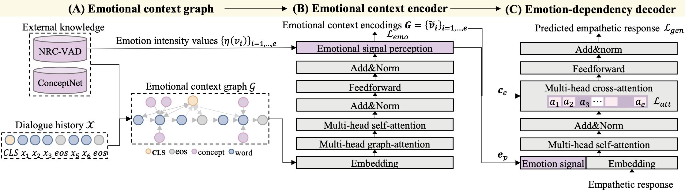

## 	Towards Empathetic Dialogue Generation over Multi-type Knowledge
 [](https://opensource.org/licenses/MIT) 

This is the official implementation for paper [Knowledge Bridging for Empathetic Dialogue Generation](https://arxiv.org/pdf/2009.09708.pdf) (AAAI 2021).

## Model Architecture




## Setup
- Check the packages needed or simply run the command:
```console
pip install -r requirements.txt
```
- Download GloVe vectors from [**here (glove.6B.300d.txt)**](http://nlp.stanford.edu/data/glove.6B.zip) and put it into `/data/`.

- Download other data sources regarding ConceptNet and NRC_VAD lexicon, please visit [**Google Drive**](https://drive.google.com/drive/folders/1IooFlLv0wbKuwdLL_3mNaQ8WWa_TCSkp?usp=sharing) and place processed dataset `kemp_dataset_preproc.json` into `/data/`.

- For reproducibility purposes, we place the model checkpoints at [**Google Drive**](https://drive.google.com/drive/folders/1w5rOOUbhcGrS6v_YDw4d18lQZUT9phJV?usp=sharing). You could download and move it under `/result/[MODELNAME]/result/`, e.g., `/result/KEMP/result/KEMP_best.tar`.

- To skip training, please check folder `/result/[MODELNAME]/predicition/`.


## Data preprocessing

The dataset (EmpatheticDialogue) is preprocessed and stored under `data` in pickle format
```bash
python preprocess.py
```


## Training
#### KEMP (Our)
```bash
python main.py \
--cuda \
--label_smoothing \
--noam \
--emb_dim 300 \
--hidden_dim 300 \
--hop 1 \
--heads 2 \
--pretrain_emb \
--model KEMP \
--device_id 0 \
--concept_num 1 \
--total_concept_num 10 \
--attn_loss \
--pointer_gen \
--save_path result/KEMP/ \
--emb_file data/glove.6B.300d.txt
```

#### KEMP w/o ECE

This model does not consider the emotional context graph of **E**motional **C**ontext **E**ncoder (ECE). 

In ECE, we enrich the dialogue history with external knowledge into an emotional context graph. Then, the emotional signals of context are distilled based on the embeddings and emotion intensity values from the emotional context graph.
```bash
python main.py \
--cuda \
--label_smoothing \
--noam \
--emb_dim 300 \
--hidden_dim 300 \
--hop 1 \
--heads 2 \
--pretrain_emb \
--model wo_ECE \
--device_id 0 \
--concept_num 1 \
--total_concept_num 10 \
--pointer_gen \
--save_path result/wo_ECE/ \
--emb_file data/glove.6B.300d.txt
```

#### KEMP w/o EDD

This model does not consider the emotional dependency strategies of **E**motion-**D**ependency **D**ecoder (EDD). 

In EDD, given emotional signal and emotional context graph, we incorporate an emotional cross-attention mechanism to selectively learn the emotional dependencies. 
```bash
python main.py \
--cuda \
--label_smoothing \
--noam \
--emb_dim 300 \
--hidden_dim 300 \
--hop 1 \
--heads 2 \
--pretrain_emb \
--model wo_EDD \
--device_id 0 \
--concept_num 1 \
--total_concept_num 10 \
--pointer_gen \
--save_path result/wo_EDD/ \
--emb_file data/glove.6B.300d.txt
```

## Testing
> Add `--test` into above commands.

You can directly run `/result/cal_metrics.py` script to evaluate the model predictions.


## Citation
If you find our work useful, please cite our paper as follows:

```bibtex
@article{li-etal-2022-kemp,
  title={Knowledge Bridging for Empathetic Dialogue Generation},
  author={Qintong Li and Piji Li and Zhaochun Ren and Pengjie Ren and Zhumin Chen},
  booktitle={AAAI},
  year={2022},
}
```


